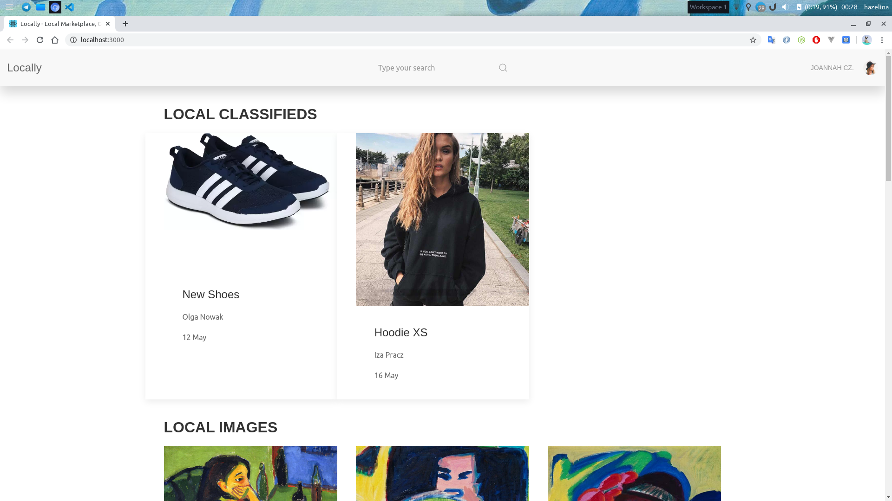
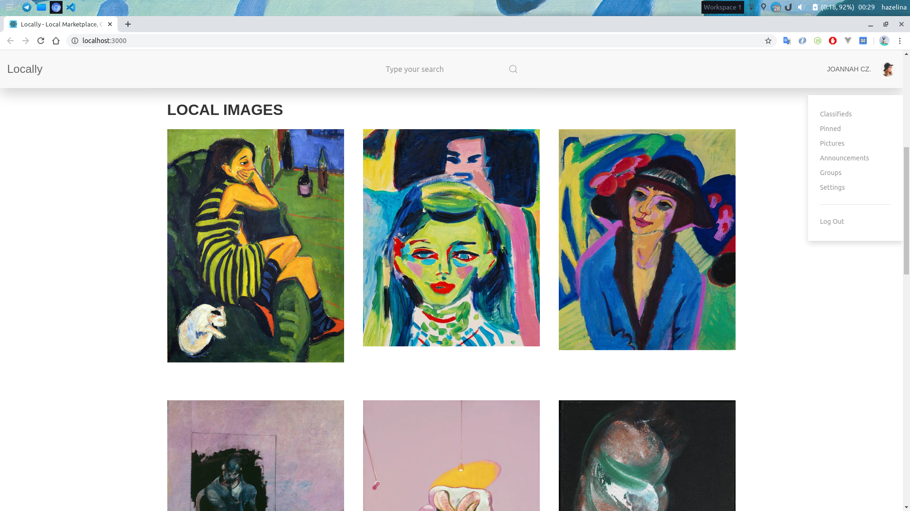
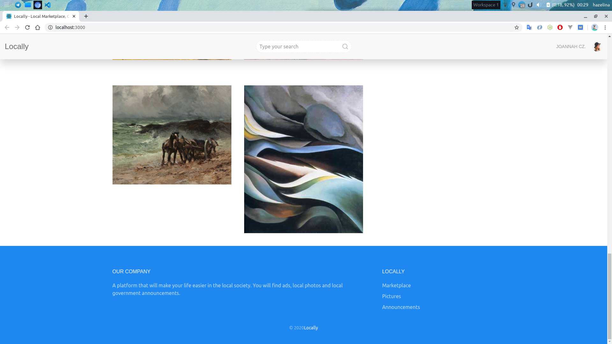
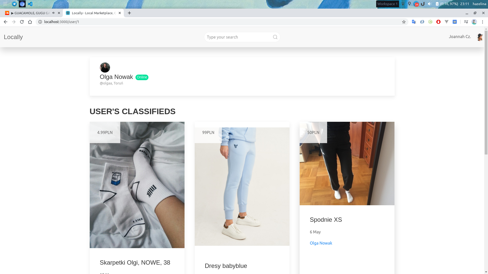
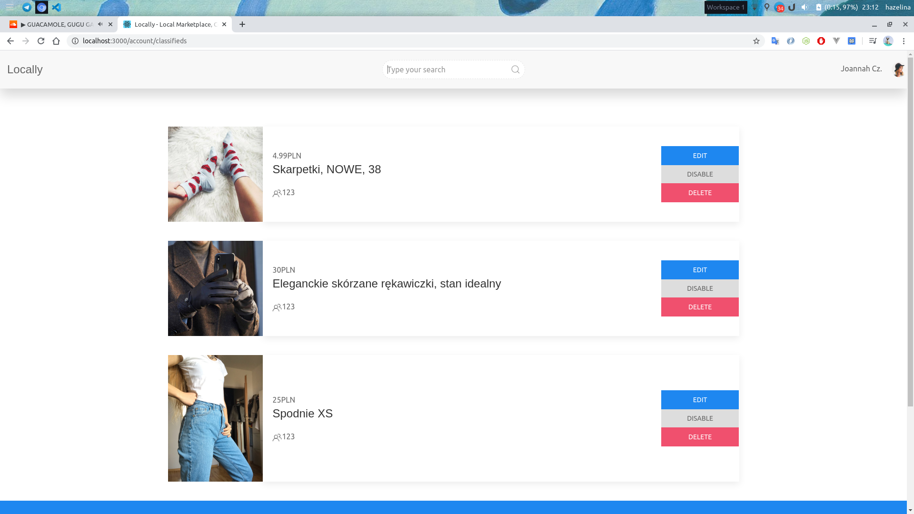

### Setup the fake backend service
It provides data, which will be served by cassandra in production mode.
1. `cd fake-backend`
2. `npm run start`
3. Open [http://localhost:3333/reactive/all](http://localhost:3333/reactive/all) view it in the browser.

### Setup react app
0. `cd ..`
1. `npm run start:local`

Runs the app in the local-development mode. 
Open [http://localhost:3000](http://localhost:3000) to view it in the browser. If you didn't see images - you must setup the fake-backend service first (see first section).

The page will reload if you make edits. 
You will also see any lint errors in the console.

## Progress
### Day first
1. 
2. 
3. 
### Updates
- added display of ads and images
- created json fake database for easy development
- added stage flags (local, dev, prod)
- first design and concept

### Day second
1. 
2. 
#### Updates
- added react router and basic routing
- updated schema of json fake database
- library uikit-react was removed and replaced with clean uikit
- the project structure was rebuilt and divided into simpler components
- added preview of user's classifieds (classifieds management panel)